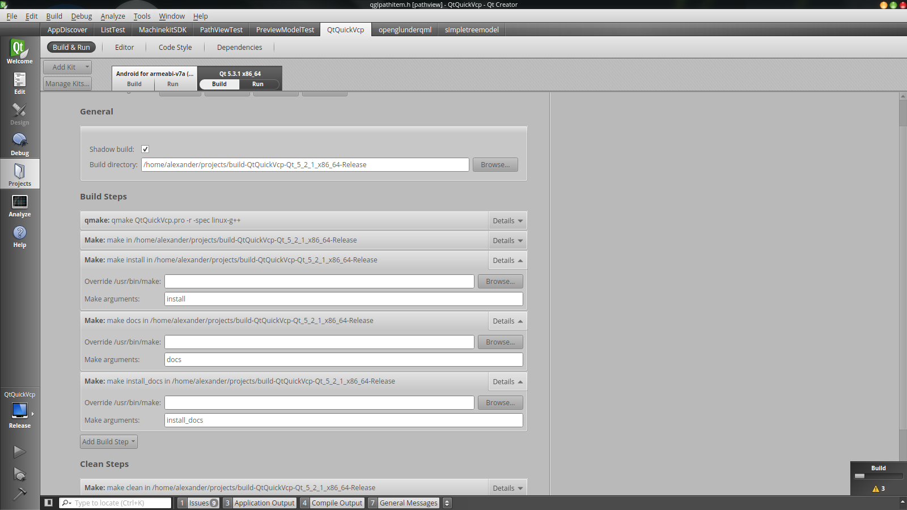
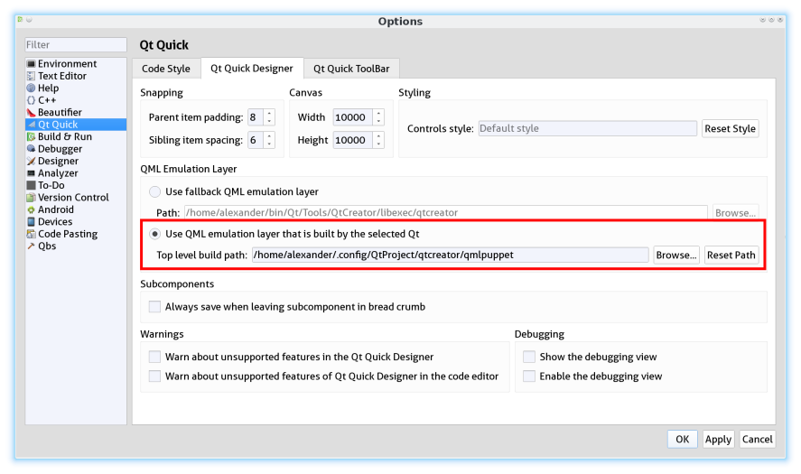

# QtQuick Virtual Control Panel

A remote user interface implementation for [Machinekit](https://github.com/machinekit/machinekit) written in Qt/C++/QML.

This repository contains the QtQuickVcp library. A generic client implementation and binary distributions can be found here [Machinekit-Client](https://github.com/machinekoder/MachinekitClient)

More details about QtQuickVcp and how it can be installed can be found in the [QtQuickVcp Wiki](https://github.com/machinekoder/QtQuickVcp/wiki/QtQuick-Virtual-Control-Panel)

Online documentation for some QtQuickVcp classes can be found here [QtQuickVcp Docu](http://static.machinekit.io/html/qtquickvcp/index.html)

## Contents

**<a href="#qtquickvcp">What is QtQuickVcp?</a>**

**<a href="#getting_started">Getting Started</a>**

* <a href="#hello_world_video">Hello World in QtQuickVcp</a>
* <a href="#qt5_uis_with_machinekitsdk">Building Qt5 UIs with MachinekitSDK</a>
* <a href="#module_overview">QtQuick Module Overview</a>
* <a href="#using_mkwrapper">Using mkwrapper</a>
* <a href="#using_mklauncher">Using mklauncher</a>

**<a href="#build_and_install">Building and Installing</a>**

* <a href="#easy_way">Easy Way - Vagrant Box</a>
* <a href="#generic_requirements">Generic Requirements</a>
* <a href="#linux_install">Linux</a>
* <a href="#windows_install">Windows</a>
* <a href="#android_install">Android</a>
* <a href="#mac_install">Mac and iOS</a>
* <a href="#building_qtquickvcp">Building QtQuickVcp</a>
* <a href="#machinekit_sdk">MachinekitSDK</a>

**<a href="#contributing">Contributing</a>**

**<a href="#developing_qtquickvcp">Developing QtQuickVcp</a>**

<a name="qtquickvcp" />
## What is QtQuickVcp?

QtQuickVcp is a Machinekit component which adds the ability create new
user interfaces for Machinekit. Unlike
[GladeVCP](http://www.linuxcnc.org/docs/2.5/html/gui/gladevcp.html)
all user interface functionality can be implemented in QML only.

QtQuickVcp is designed with the aspect of remote interfaces on mobile devices and embedded systems
in mind. A UI is designed once for a specific form factor and can then be deployed to any mobile, embedded
or desktop device over the network.

<a name="getting_started" />
## Getting Started
A good way to get started is to watch the video tutorials on YouTube.

Another resource for learning about QtQuickVcp, Machinekit and other
machine control related stuff is [Machine Koder Blog](http://machinekoder.com)

<a name="hello_world_video" />
### HelloWorld in QtQuickVcp
[](http://www.youtube.com/watch?v=hyY1DoJ3mOA)

<a name="qt5_uis_with_machinekitsdk" />
### Building Qt5 UIs with MachinekitSDK
[](https://www.youtube.com/watch?v=IdB5769JtqI)

More detailed videos for specific areas will follow.

<a name="module_overview" />
### QtQuick Module Overview
QtQuickVcp comes with the following QtQuick modules.

* *Machinekit.HalRemote* - Non GUI HAL remote pins and components
* *Machinekit.HalRemote.Controls* - GUI items such as Slider and ProgressBar combined with HAL pins
* *Machinekit.Application* - Non GUI CNC stack application components
* *Machinekit.Application.Controls* - GUI items for CNC type applications
* *Machinekit.Controls* - Generic UI items not combined with HAL pins (can be used for non HAL projects)
* *Machinekit.PathView* - GCode path and progress views
* *Machinekit.VideoView* - Video views, e.g. for mjpeg-webcam streams

<a name="using_mkwrapper" />
### Using mkwrapper
Mkwrapper is the Machinekit server side application for the
Machinekit.Application modules. This short intro will help you making
your Machinekit configuration work with mkwrapper.

#### Install or Update Machinekit
If you have no Machinekit installation please follow the installation steps in the wiki [Debian Packages](http://www.machinekit.io/docs/packages-debian/)

If you already have Machinekit installed make sure it is up to date:

    sudo apt-get update
    sudo apt-get upgrade

In some cases you need a `dist-upgrade` to upgrade packages from non-debian repositories.

    sudo apt-get dist-upgrade

**NOTE:** When executing the `dist-upgrade`, make sure you have only the Debian and the Machinekit repositories activated. Alternatively, you can update the relevant Machinekit packages manually by running `sudo apt-get install <machinekit packages>`. 

#### Prepare Machinekit
To enable remote communication you have to set `REMOTE` variable to `1` in the ini-file:

    sudo nano /etc/linuxcnc/machinekit.ini

**NOTE:** Enable remote communications only in a **secured private network**. At the moment Machinetalk has no security layer.

#### Prepare your Configs
To use mkwrapper and Machinetalk for your existing configurations you have to do 3 modifications.

##### Modify the INI-file
Linuxcnc needs to know which user-inferface it should use. For mkwrapper you need to edit following in the *DISPLAY* section:

    DISPLAY = mkwrapper
    INTRO_GRAPHIC =
    INTRO_TIME = 0

##### Modify the HAL-file
For some user-interface you need a running Haltalk server. You can add one to you existing configuration by adding following in the beginning of the HAL-file:

    # start haltalk server
    loadusr -W haltalk

##### Create a Run-Script
Machinekit configurations need a few actions to be performed before linuxcnc can start. Take a look at the following script and modify it to fit your configuration. 

Name it `<name of your configuration>.py` and run `chmod +x <filename>` to make it executable.

**NOTE:** The example run script contains commands that you may not need for your specific setup. Please **read the comments** carefully and **uncomment and modify commands** that you may need for your setup.

```python
#!/usr/bin/python

import sys
import os
import subprocess
import importlib
from machinekit import launcher
from time import *


launcher.register_exit_handler()
launcher.set_debug_level(5)
os.chdir(os.path.dirname(os.path.realpath(__file__)))

try:
    launcher.check_installation()  # make sure the Machinekit installation is sane
    launcher.cleanup_session()  # cleanup a previous session
    # Uncomment and modify the following line if you create a configuration for the BeagleBone Black
    # launcher.load_bbio_file('myoverlay.bbio')  # load a BeagleBone Black universal overlay file
    # Uncomment and modify the following line of you have custom HAL components
    # launcher.install_comp('gantry.comp')  # install a comp HAL component if not already installed
    launcher.start_process("configserver ~/Machineface ~/Cetus/")  # start the configserver with Machineface an Cetus user interfaces
    launcher.start_process('linuxcnc xyz.ini')  # start linuxcnc
except subprocess.CalledProcessError:
    launcher.end_session()
    sys.exit(1)

# loop until script receives exit signal
# or one of the started applications exited incorrectly
# cleanup is done automatically
while True:
    sleep(1)
    launcher.check_processes()
```

##### Modifications for 3D Printers
The Machineface user interface is especially designed for controlling 3D printers. Therefore it features some additional controls for heatbed, extruder temperature and more. It implements following a set of [MCodes](https://github.com/machinekoder/TCT3D/blob/revision2/UNIPRINT-3D.ini#L86) as well as a few [HAL signals](https://github.com/machinekoder/TCT3D/blob/revision2/UNIPRINT-3D.hal#L610). You may also want to take a look at the source code of Machineface: [DisplayPanel.qml](https://github.com/machinekoder/Machineface/blob/master/Machineface/DisplayPanel.qml#L54)

#### Cloning the User Interfaces
At the moment two user interfaces based on QtQuickVcp exist:

[Machineface](https://github.com/machinekoder/Machineface): a user interfaces designed for the use with small screens especially for 3D printers

[Cetus](https://github.com/machinekoder/Cetus.git): a full-featured user interfaces that should provide something like Axis

Clone both user interfaces on your device with Machinekit installed. I recommend **forking the user interfaces on GitHub** and cloning the fork so you can push modifications upstream quickly. To modify these user interfaces a simple text editor is sufficient. Using a text editor with syntax highlighting for QML might improve the development experience. (e.g. Kate or Qt Creator)

    git clone https://github.com/machinekoder/Cetus.git
    git clone https://github.com/machinekoder/Machineface.git

#### Install the Machinekit-Client
For desktop platforms (**Linux, Windows, Mac**) you can find binaries here: [Machinekit-Client releases](http://buildbot.roessler.systems/files/machinekit-client/)

You can find the **Android** client here
[](https://play.google.com/store/apps/details?id=io.machinekit.appdiscover)

Please note: the Android client installed on Android >= 5.0 is not able to discover Machinekit.

If you an idea how to deploy the **iOS** client besides the Apple App Store please contact me.

#### Test it
Now its time to start your configuration:

    ./<name of your start script>.py

It may be useful to start the configuration at boot: [Starting a Machinekit configuration at boot](https://github.com/machinekoder/asciidoc-sandbox/wiki/Starting-a-Machinekit-configuration-at-boot)

Now start the Machinekit-Client on the desired platform. For some networks it may be necessary to enter the IP address of the Machinekit device manually (Unicast).

#### Setup mklauncher
With newer versions of QtQuickVcp the entry point for the Machinekit-Client has been changed to the mklauncher service. Please follow the steps here for more details [Using mklauncher](https://github.com/machinekoder/QtQuickVcp/wiki/Using-mklauncher)

<a name="using_mklauncher" />
### Using mklauncher
Mklauncher is the new entry point for Machinekit-Client. It acts as a remote version of the Machinekit Launcher. Usage is quite simple (use =mklauncher --help= for details) the only thing you need to add to your Machinekit configarion is a =launcher.ini= file.

```ini
[MendelMax]
name = MendelMax CRAMPS
description = DIY 3D printer
command = python run.py
variant = with one extruder
```

More examples can be found here [MendelMax-CRAMPS](https://github.com/machinekoder/MendelMax-CRAMPS/blob/master/launcher.ini) and here [thecooltool-config](https://github.com/thecooltool/machinekit-configs/blob/master/launcher.ini).

Once you have create a `launcher.ini` file and you configuration is ready for testing you can start mklauncher by typing following command:

```
mklauncher .
```

The dot in the end means that mklauncher will recursively search for `launcher.ini` files in the current directory. NOTE that this can be very slow if you do this in your home directory.

Once you have successfully launched mklauncher you are ready to connect using the [Machinekit-Client](https://github.com/machinekoder/MachinekitClient).

If you have a embedded Machinekit setup e.g. on the BeagleBone Black, it is recommended to start mklauncher at boot using systemd. Use this guide for reference: [Starting a Machinekit configuration at boot](https://github.com/machinekoder/asciidoc-sandbox/blob/master/Starting-a-Machinekit-configuration-at-boot.md) or use this script [register.py](https://gist.github.com/machinekoder/3eaa42f79f7a19e2244a).

<a name="build_and_install"/>
## Building and installing
QtQuickVcp is very versatile and is available for following platforms:

* Windows Vista or newer
* OS X Mavericks or newer
* Linux (tested on Debian Jessie)
* Android 4.x or newer
* iOS (no binaries yet)

Please note that intalling QtQuickVcp can be very cumbersome for most
platforms. However, since QtQuickVcp use **remote deployment** of it
is not necessary that you build QtQuickVcp e.g. for Android. Instead
please **take the easy way** and use the
[Machinekit Vagrant box](https://github.com/machinekoder/machinekit-vagrant)
for development. The
[Machinekit-Client](https://github.com/machinekoder/MachinekitClient) serves
as universal client application. You can download binaries for all
supported platforms. Please only try to build and install QtQuickVcp
on you own if you feel confident to do so and if you plan to
contribute to the QtQuickVcp project.

<a name="easy_way" />
### Easy Way - Vagrant Box
The easiest way to get a running MachinekitSDK, QtQuickVcp and Machinekit installation is to use
the [Vagrant configuration](https://github.com/machinekoder/machinekit-vagrant). Follow the steps provided
in the repository and you will have a working installation with a few clicks.

<a name="generic_requirements" />
### Generic Requirements
QtQuickVcp has the following requirements:

* [Qt SDK](http://qt-project.org/downloads) with Qt 5.4.0 or newer
    **Note** that Qt 5.4.2 to Qt 5.5.1 will not work on Linux
* [Protocol Buffers](https://developers.google.com/protocol-buffers/) - version 2.5.1 or newer
* [ZeroMQ](http://zeromq.org/) - version 3.x or newer

```
error C2338: <hash_*> is deprecated and will be REMOVED. Please use <unordered_*>.
You can define _SILENCE_STDEXT_HASH_DEPRECATION_WARNINGS to acknowledge that you have received this warning.
```
If MSVC2015 is the only option you have, add  `_SILENCE_STDEXT_HASH_DEPRECATION_WARNINGS=1;`  to "Preprocessor Definitions" entry under Project Properties.
See also [C++ Hash Deprecation Warning](http://stackoverflow.com/q/30430789/4599792)

<a name="android_install" />
### Android
Build instruction for Android toolchain on Linux
#### Prerequisites
* Install [Qt SDK for Android](http://www.qt.io/download-open-source/)
* Download and extract [Android NDK](http://developer.android.com/ndk/downloads/index.html) and [Android SDK](http://developer.android.com/sdk/index.html#Other) to `~/bin`

#### Stand-alone Android toolchain
First create a Android Stand-alone toolchain:

    sudo ~/bin/android-ndk/build/tools/make-standalone-toolchain.sh --install-dir=/opt/android-toolchain --arch=arm
    export PATH=/opt/android-toolchain/bin:$PATH

#### libsodium
**Not yet necessary. You can skip this step.**

    git clone https://github.com/jedisct1/libsodium.git
    cd libsodium
    git checkout v1.0.8
    sh autogen.sh
    ./configure --enable-static --disable-shared --prefix=$OUTPUT_DIR
    make
    sudo make install

#### ZeroMQ
Alter and execute the following commands

    mkdir tmp
    cd tmp/

    export OUTPUT_DIR=/opt/zeromq-android
    export RANLIB=/opt/android-toolchain/bin/arm-linux-androideabi-ranlib

    git clone https://github.com/zeromq/zeromq4-x.git
    cd zeromq4-x/
    git checkout v4.0.7

    # fix compile problems
    mv tools/curve_keygen.c tools/curve_keygen.cpp
    sed -i 's/\.c\>/&pp/' tools/Makefile.am
    rm -f tools/.deps/curve_keygen.Po

    ./autogen.sh
    ./configure --enable-static --disable-shared --host=arm-linux-androideabi --prefix=$OUTPUT_DIR \
    LDFLAGS="-L$OUTPUT_DIR/lib" CPPFLAGS="-fPIC -I$OUTPUT_DIR/include" LIBS="-lgcc"
    make
    sudo make install

    cd ..

#### Protobuf

    export PATH=/opt/android-toolchain/bin:$PATH
    export CFLAGS="-fPIC -DANDROID -nostdlib"
    export CC=arm-linux-androideabi-gcc
    export CXX=arm-linux-androideabi-g++
    export NDK=~/bin/android-ndk
    export SYSROOT=$NDK/platform/android-9/arch-arm
    export OUTPUT_DIR=/opt/protobuf-android

    # Latest and greatest, you might prefer 2.5.0 since it is usually installed in your distro
    git clone https://github.com/google/protobuf.git
    cd protobuf
    git checkout v2.6.1

    ./autogen.sh
    ./configure --enable-static --disable-shared --host=arm-eabi --with-sysroot=$SYSROOT CC=$CC CXX=$CXX --enable-cross-compile --with-protoc=protoc LIBS="-lc" --prefix=$OUTPUT_DIR
    make
    sudo make install

<a name="mac_install" />
### Mac - OS X and iOS
#### Prerequisites
* Update [OSX to the latest version](http://www.apple.com/osx/how-to-upgrade/) (or you may not be able to deploy to your device)
* Install [XCode from the App Store](https://itunes.apple.com/us/app/xcode/id497799835)
* Install [XCode command line tools](http://railsapps.github.io/xcode-command-line-tools.html)
* Install [MacPorts](http://www.macports.org/install.php)
* Install [Qt SDK for Mac OSX and iOS](http://www.qt.io/download-open-source/)

Then run

    sudo port selfupdate
    sudo port install libtool automake m4 autoconf pkgconfig


#### ZeroMQ
##### OSX
Install ZeroMQ to `/opt/local`

    git clone https://github.com/zeromq/zeromq4-x.git
    cd zeromq4-x
    git checkout v4.0.7
    sh autogen.sh
    ./configure --disable-static --enable-shared --prefix=/opt/local CC=clang CXX=clang++ CXXFLAGS="-std=c++11 -stdlib=libstdc++ -O3" LDFLAGS="-stdlib=libstdc++"
    make
    sudo make install

##### iOS
Installs ZeroMQ libraries for iOS to `/opt/zeromq-ios`

    git clone https://github.com/machinekoder/libzmq-ios
    cd libzmq-ios
    chmod +x libzmq-ios.sh
    sudo ./libzmq-ios.sh

#### Protobuf
##### OSX
Since Yosemite one needs to compile a protobuf library that is compatible with libstdc++.

    git clone https://github.com/google/protobuf.git
    cd protobuf
    git checkout v2.6.1
    sh autogen.sh
    ./configure --disable-shared --enable-static --prefix=/opt/local CC=clang CXX=clang++ CXXFLAGS="-std=c++11 -stdlib=libstdc++ -O3" LDFLAGS="-stdlib=libstdc++"
    make
    sudo make install

##### iOS
See https://gist.github.com/machinekoder/847dc5f320a21f1a9977 installs protobuf to `/opt/protobuf-ios`

    curl    https://gist.githubusercontent.com/machinekoder/847dc5f320a21f1a9977/raw/f3baa89c9aa7ff3300d4453b847fc3d786d02ba8/build-protobuf-2.6.1.sh --output build-protobuf-2.6.1.sh
    chmod +x build-protobuf-2.6.1.sh
    sudo ./build-protobuf-2.6.1.sh

<a name="linux_install" />
### Linux
The following steps are tested on **Debian Jessie**. For other
distributions please use the äquivalent packages if available.

**VirtualBox users** see
[Machinekit Vagrant](https://github.com/strahlex/machinekit-vagrant). Do
not enable 3D acceleration or OpenGL will not work inside the VM.

#### Prerequisites

    sudo apt-get update
    sudo apt-get install build-essential gdb dh-autoreconf libgl1-mesa-dev libxslt1.1 git

##### Protobuf and ZeroMQ packages

    sudo apt-key adv --keyserver keyserver.ubuntu.com --recv 43DDF224
    sudo sh -c \
    "echo 'deb http://deb.machinekit.io/debian jessie main' > \
    /etc/apt/sources.list.d/machinekit.list"
    sudo apt-get update
    sudo apt-get install pkg-config libprotobuf-dev protobuf-compiler libzmq3-dev

##### Protobuf from source

    git clone https://github.com/google/protobuf.git
    cd protobuf
    git checkout v2.6.1
    ./autogen.sh
    ./configure
    make
    sudo make install

##### ZeroMQ from source

    git clone https://github.com/zeromq/zeromq4-x.git
    cd zeromq4-x/
    git checkout v4.0.7
    ./autogen.sh
    ./configure     # add other options here
    make
    make check
    sudo make install

<a name="windows_install" />
### Windows
If you want to use Windows in a VirtualBox VM please enable 3D acceleration for Qt to work properly.

#### Prerequisites
* Install everything to `C:\bin`
* Install Microsoft Visual Studio of your choice
 * [2015 Community Edition](https://www.visualstudio.com/en-us/downloads/download-visual-studio-vs.aspx)
 * [2013 Express Edition](https://www.microsoft.com/en-us/download/details.aspx?id=44914)
* Install [Qt SDK](http://www.qt.io/download-open-source/) for Windows (Use the MSVC2015 or MSVC2013 version depending on Visual Studio)
* Install a Git command line client (VS2015 comes with Git, [Git for Windows](https://git-for-windows.github.io/) is also fine, select add to Windows Path in setup)
* Create a link from your users directory to `C:\bin`
 * Run in cmd window as administrator: `mklink /D C:\Users\%USERNAME%\bin C:\bin`

#### ZeroMQ
Open a cmd window:

    cd C:\bin
    git clone https://github.com/zeromq/zeromq4-x.git
    cd zeromq4-x
    git checkout v4.0.7

Now start Visual Studio and open the solution `C:\zeromq4-x\builds\msvc\msvc11.sln` say yes to migrating the project to the new format.

Wait a few seconds until parsing the header files is finished. Then select the Release build.

Now right click on the libzmq project in the Solutions Explorer and click build.

Now select the Win32 build.

Now right click on the `libzmq11` project in the Solutions Explorer and click build.

Copy the `libzmq.dll` and `libzmq.pdb` files from `zeromq4-x\bin\Win32` to the `Qt\<version>\<release>\bin` folder.

Same for `x64`

#### Protobuf
Open a cmd window:

    cd C:\bin
    git clone https://github.com/google/protobuf.git
    cd protobuf
    git checkout v2.6.1

Now start Visual Studio and open the solution `C:\protobuf\vsprojects\protobuf.sln` say yes to migrating the project to the new format.

Wait a few seconds until parsing the header files is finished. Then select the Release build.

Now right click on the libprotobuf project in the Solutions Explorer and click build. Also see [MSVC2015](#msvc2015)

Repeat this step for libprotobuf-lite, libprotoc and protoc.

Copy the `libprotobuf.lib` files from `protobuf\vsprojects\Release` to the `Qt\<version>\<release>\lib` folder.

Copy the `libprotobuf.pdb` files from `protobuf\vsprojects\Release` to the `Qt\<version>\<release>\bin` folder.

Repeat for `x64` in `protobuf\vsprojects\x64\Release`.

##### MSVC2015
Even if you have the option to use MSVC2015, use MSVC2013 instead by changing the platform tool set to Visual Studio 2013,
as you will get this kind of compiler error with MSVC2015:
````
error C2338: <hash_*> is deprecated and will be REMOVED. Please use <unordered_*>.
You can define _SILENCE_STDEXT_HASH_DEPRECATION_WARNINGS to acknowledge that you have received this warning.
````
If MSVC2015 is the only option you have, add  `_SILENCE_STDEXT_HASH_DEPRECATION_WARNINGS=1;`  to "Preprocessor Definitions" entry under Project Properties.
See also [C++ Hash Deprecation Warning](http://stackoverflow.com/q/30430789/4599792)

<a name="building_qtquickvcp" />
### Building QtQuickVcp

After you have all the requirements installed clone and build the [QtQuickVcp repo](https://github.com/machinekoder/QtQuickVcp).

    git clone https://github.com/machinekoder/QtQuickVcp

Before building the project **modify the paths.pri file if necessary**.

#### Build from Qt Creator
Open Qt Creator and open the QtQuickVcp.pro file. Select the Qt version you want to build against. Before building the project add these additional make commands to your project settings:
`install, docs and install_docs`


Build the project in release mode (or debug mode if you want to debug QtQuickVcp and you application). Now you should have a working QtQuickVcp installed to your Qt version.

#### Setup Qt Creator
Per default Qt Creator's QtQuick designer does not work with custom QML modules. Therefore, it is necessary to enable building a working QML emulation layer. This can be done in the Qt Creator preferences **Tools > Options...** in the **Qt Quick register** by selecting the **Use QML emulation layer that is built by the selected Qt** option. The build path is automatically completed.



#### Build from command line (Linux only)
The following steps assume that you have the Qt SDK installed in `~/bin/Qt/`

``` bash
# set QMAKE
QMAKE=~/bin/Qt/5.*/gcc*/bin/qmake
QT_INSTALL_PREFIX=~/bin/Qt/5.*/gcc*

# download and install QtQuickVcp
git clone https://github.com/machinekoder/QtQuickVcp
mkdir -p build/QtQuickVcp
cd build/QtQuickVcp

$QMAKE ../../QtQuickVcp
# to build without plugins.qmltypes use:
# $QMAKE ../../QtQuickVcp QMLPLUGINDUMP=0
make
make docs
make install
make install_docs
```

<a name="machinekit_sdk" />
### MachinekitSDK
If you also want to have QtQuickVcp specific wizards and extensions
for QtCreator please continue with the install instructions for the [MachinekitSDK](https://github.com/machinekoder/MachinekitSDK)

<a name="contributing"/>
## Contributing

* Create an issue in the issue tracker (e.g. Fan control missing)
* Fork the git repository.
* After you have coded some cool new stuff please create a pull request and link it to the issue.

<a name="developing_qtquickvcp" />
## Developing QtQuickVcp
This wiki page is for developers who want to extend the functionality of QtQuickVcp.

If you are new to Qt and/or QtQuick I would recommend you to read the Qt documentation and follow the getting started and tutorials: http://qt-project.org/doc/qt-5/gettingstartedqml.html

### Choosing the right QML module
QtQuickVcp is split into several QML modules:

* *Machinekit.HalRemote* - Non GUI HAL remote pins and components
* *Machinekit.HalRemote.Controls* - UI items such as Slider and ProgressBar combined with HAL pins
* *Machinekit.Controls* - Generic UI items not combined with HAL pins (can be used for non HAL projects)
* *Machinekit.PathView* - GCode path and progress views
* *Machinekit.VideoView* - Video views, e.g. for mjpeg-webcam streams

You can find these modules as *separate folders* inside the *src* folder of QtQuickVcp. E.g. the folder
containing the module *Machinekit.HalRemote* is *src/halremote*

### Creating new QML based Components

QML files are the preferred way of creating new visual QtQuickVcp Components. Just create a new QML file
using the New File dialog and then you can either use the Qt Quick Desinger or the text editor to develop
your components. I recommend you to use the text editor as you will learn how to use make use of QtQuick faster and the Designer is currently far from perfect.

A good way to start is looking at the existing QML Components and how they are implemented.
Please make sure you make use of http://qt-project.org/doc/qt-5/qtquick-usecase-layouts.html[anchors or layout] based positioning wherever possible as it saves computation power and makes your UIs scaleable.

### Adding QML files to the QML module

You need to add the newly created QML files to following places in order to make them work when the QML module is deployed.

* *.pro file of the module* to the *QML_FILES* variable
* *.qrc file of the module*
* *plugin.cpp of the module* to the *qmldir structure*
* *.metainfo file in designer folder*

### Creating new C++ based Components
For some functionality it is necessary to develop C\++ based QtQuickVcp Components. This may include visual items that need access to native OpenGL painting instructions, visual items that use QPainter to paint on a canvas and non visual items that need performance, access to Qt/C++ functionality or native C/C++ libraries.

#### Adding C++ classes to the QML module

You need to add the C++ classes to following places in order to make them work when the QML module is deployed.

* *plugin.cpp of the module* with *qmlRegisterType*
* *.metainfo file of the Qt Quick Designer plugin*

### Creating a new QML module

TODO

### Adding the QML module to the project

* `QtQuickVcp.pro (OTHER_FILES, doc folder)`
* src/src.pro
* `doc/config/qtquickvcp-project.qdocconf (sourcedirs)`
